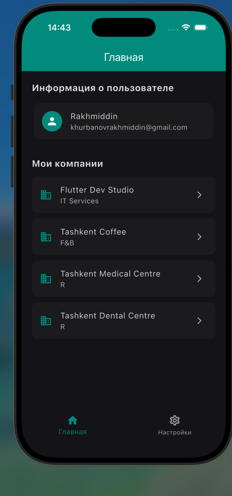
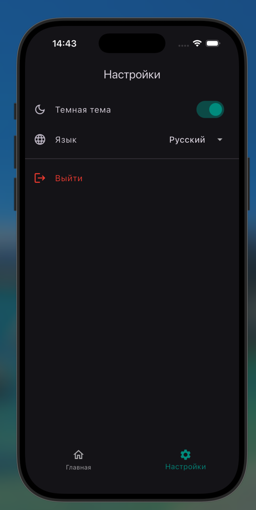
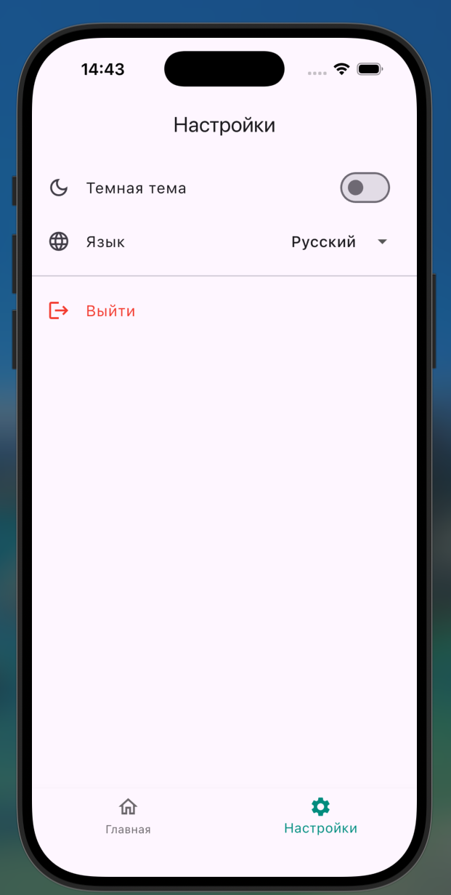
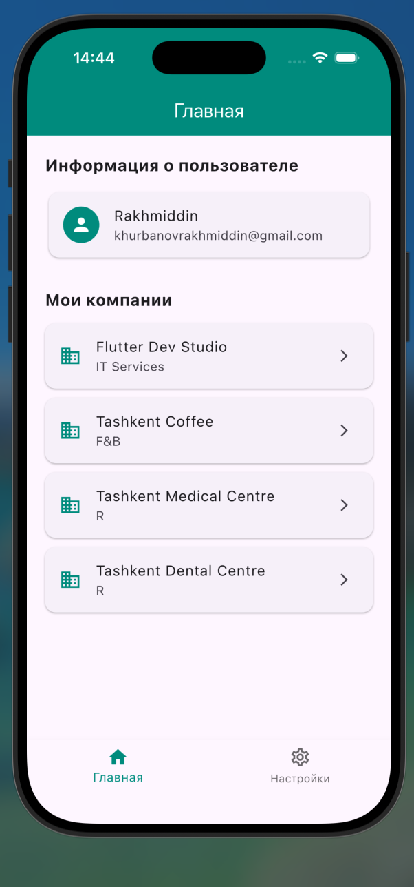
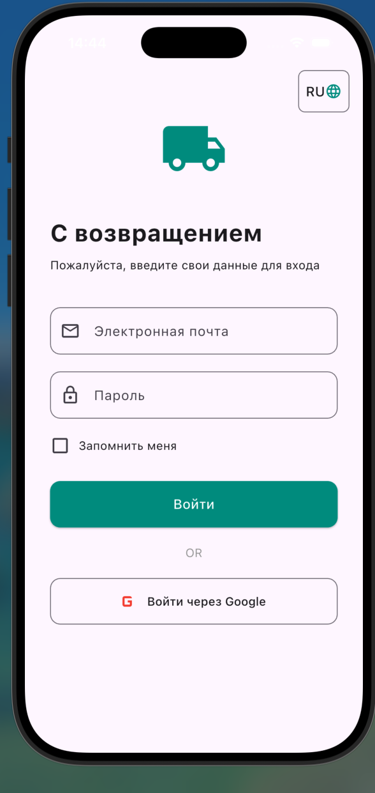

### 📸 Screenshots

  
  
  
  
  

---

### 📥 Как установить приложение

1. **Разрешить установку:** В настройках Android разрешите установку из неизвестных источников.
2. **Скачать APK:** Загрузите файл по ссылке ниже и откройте его для начала установки.
3. **Запуск:** После завершения установки приложение появится на главном экране.

---

### 🚀 Ссылка на файл

[Скачать APK файл](assets/file/app-release.apk)
